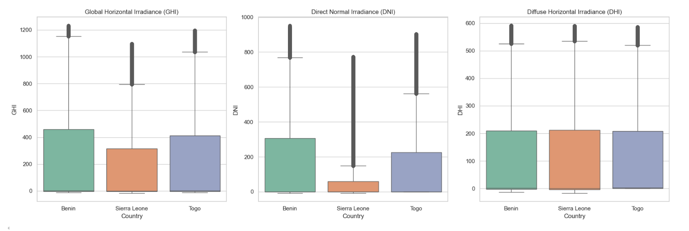

# Solar_Strategy_Insights

## Strategic Analysis of Solar Infrastructure in West Africa

This project analyzes solar energy infrastructure and production data in **Benin**, **Sierra Leone**, and **Togo** to uncover actionable insights for decision-makers. The goal is to support investment, optimization, and expansion of renewable energy solutions in under-served regions.

---

## Project Structure

solar-strategy-insights/

├── src/ # Raw datasets

├── notebooks/ # Jupyter notebooks for analysis and EDA

├── Cleaned_data/ # cleaned datasets

├── scripts/ # Reusable Python scripts for preprocessing and analysis

└── README.md # Project documentation

---

# Solar Potential Analysis in West Africa

This project analyzes solar irradiance data from three West African countries — **Benin**, **Togo**, and **Sierra Leone** — to uncover trends and evaluate their potential for solar energy investment.

---

## Project Overview

The goal of this project is to compare key solar irradiance metrics across these countries and identify which region offers the most consistent and high-performing solar energy profile. The metrics explored include:

- **GHI** – Global Horizontal Irradiance  
- **DNI** – Direct Normal Irradiance  
- **DHI** – Diffuse Horizontal Irradiance

---

## Repository Structure

├── notebooks/

│ ├── benin__eda.ipynb # Exploratory analysis of Benin solar farm data

│ ├── sierra_leone__eda.ipynb # Exploratory analysis of sierra_leone solar farm data

│ ├── togo__eda.ipynb # Exploratory analysis of togo solar farm data

│ └── compare_countries.ipynb # Comparative analysis across Benin, Togo, and Sierra Leone

├── [Final_Solar_Potential_Report.md](https://drive.google.com/file/d/1--SAQyp25HnuDs-Y7BhlnfmRAom9Vgkn/view?usp=sharing) # Full report of methodology and findings

├── solar_irradiance_boxplots.png # Visualization output

├──Cleaned_data/ # Folder containing raw or cleaned CSV datasets

│ ├── benin_clean.csv

│ ├── sierra_leone_clean.csv

│ └── togo_clean.csv 

---

## Tools & Technologies

- **Python** (Pandas, Matplotlib, Seaborn)
- **Jupyter Notebook**
- **Word / PDF** *(for final report generation)*

---

## Key Findings

- **Benin** exhibits the highest solar irradiance across all three metrics, making it a strong candidate for solar investment.
- **Togo** shows competitive performance, though slightly lower than Benin.
- **Sierra Leone** has the most variability and generally lower values, indicating possible need for hybrid systems.

---

## Challenges & Solutions

| Challenge | Solution |
|----------|----------|
| Inconsistent data formats | Standardized using `pandas.to_datetime()` |
| Missing values | Filled using interpolation and forward-fill |
| Comparative analysis | Merged datasets and grouped by country for unified plots |

---

## Recommendations

- Add **seasonality analysis** using multi-year data
- Incorporate **weather context** (e.g., cloud cover, temperature)
- Build a **Power BI dashboard** for decision-makers
- Train a **predictive model** for solar energy forecasting

---

## Results

Summary statistics revealed:

| Country        | GHI (Mean) | DNI (Mean) | DHI (Mean) |
|----------------|------------|------------|------------|
| **Benin**       | 232.78     | 164.44     | 110.04     |
| **Togo**        | 219.96     | 145.37     | 110.84     |
| **Sierra Leone**| 179.27     | 100.90     | 104.75     |

---

## Final Report

Read the full report in https://drive.google.com/file/d/1--SAQyp25HnuDs-Y7BhlnfmRAom9Vgkn/view?usp=sharing for details on:
- Objectives
- Methodology
- Data Challenges
- Recommendations
- Conclusions

---

## Author

**Oliyad Teshome**  
📧 oliyadteshomedida@gmail.com  
📞 +251 982152928

---

## 🏁 License

This project is for educational and portfolio purposes. For commercial use, please contact the author.
